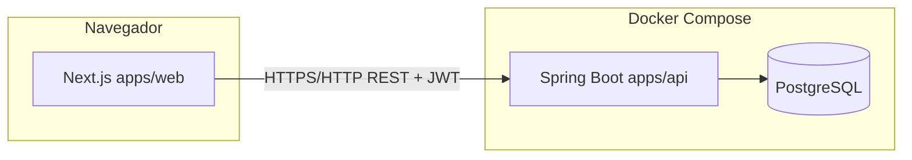
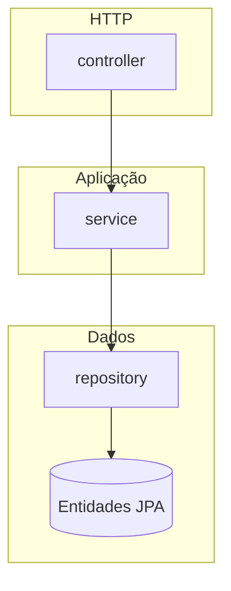

# Arquitetura — HH Financeiro v6

Visão de alto nível para **onboarding** e **entrevistas técnicas**.

## Stack

| Camada | Tecnologia |
|--------|------------|
| API | Java 21, Spring Boot 3, Spring Web, Spring Data JPA, Spring Security |
| Persistência | PostgreSQL (produção/dev), Flyway para versão de schema |
| Auth | JWT stateless (Bearer), senhas com BCrypt |
| Contrato | OpenAPI 3 via SpringDoc; tipos TS gerados (`packages/types`) |
| Web | Next.js 15 (App Router), React 19, TanStack Query, Tailwind CSS |
| Infra local | Docker Compose: `db` + `api` + `web` |

## Diagrama de componentes (deploy local)

## Camadas da API (`apps/api`)

- **`controller`**: mapeia rotas `/api/v1/...`, valida DTOs, obtém `user_id` via `CurrentUser` (token JWT).
- **`service`**: regras de negócio e transações (`@Transactional`).
- **`repository`**: Spring Data JPA; consultas por `user_id` para isolamento entre utilizadores.
- **`security`**: `JwtAuthFilter` extrai o token, define `Authentication` com principal = `userId` (`Long`).

## Frontend (`apps/web`)

- **Rotas públicas**: `/`, `/login`.
- **Área autenticada** (`/dashboard/*`): layout verifica token em `localStorage`, navegação por links, dados via `fetch` + TanStack Query.
- **Cliente HTTP** (`lib/api.ts`): prefixo `NEXT_PUBLIC_API_URL`, header `Authorization: Bearer`.

## Onde está o “contrato” da API

1. Código Java (controllers + DTOs).
2. **`/v3/api-docs`** em runtime.
3. **`packages/types/openapi.snapshot.json`** versionado no repo (CI gera `api.d.ts`).

---

Para fluxos de utilizador, ver [FLOWS.md](./FLOWS.md).
