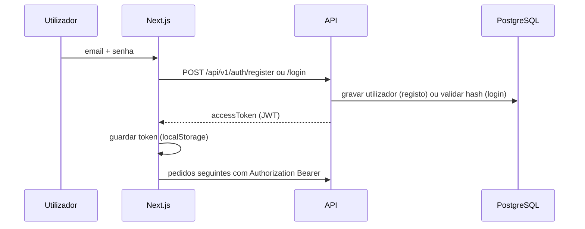
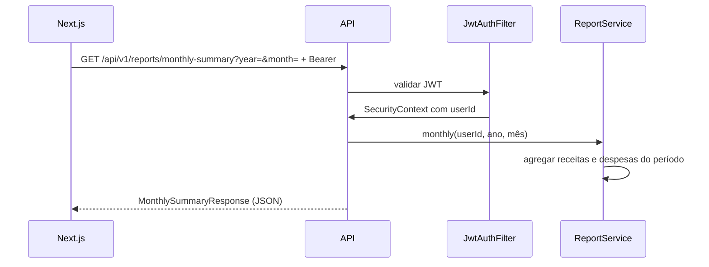

# Fluxos principais — HH Financeiro v6

## 1. Registo e login

## 2. Pedido autenticado (ex.: resumo mensal)

## 3. Isolamento por utilizador

Todas as operações sobre dados financeiros filtram por **`user_id`** derivado do JWT. Dois utilizadores nunca partilham linhas na base de dados através da API.

## 4. Orçamento (upsert)

- **GET** `/api/v1/budgets?year=&month=` — lista orçamentos do mês.
- **POST** `/api/v1/budgets` — cria ou atualiza por chave lógica (utilizador + ano + mês + categoria).
- **DELETE** `/api/v1/budgets/{id}` — remove se o orçamento pertencer ao utilizador.

## 5. Metas e depósitos

- CRUD em `/api/v1/goals`.
- **POST** `/api/v1/goals/{id}/deposits` — regista valor e incrementa `currentAmount` da meta.

---

Diagramas em [Mermaid](https://mermaid.js.org/); podem ser pré-visualizados no GitHub ou em extensões do VS Code/Cursor.
